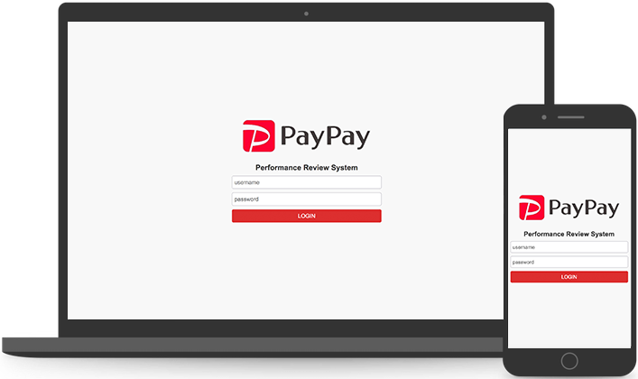

# PayPay Performance Review System



## Setup

frontend:

```
cd client
npm install && npm start
```

backend:

```
redis-server

cd server
npm install && npm run migrate && npm run dev
```

test account:

```
username: admin,
password: 123456
```

cypress test (partially covered):

```
cd client
npm run cypress-gui
```

## Tech Stack

frontend(create-react-app): React, React-router, sass, Cypress  
backend(express-generator): Express, MySQL, redis

## Assumptions

- assumed only admin can create user and view feedbacks.
- assumed no large amount of users.
- assumed all the reviews are anonymous.
- assumed feedback cannot be modified after added.
